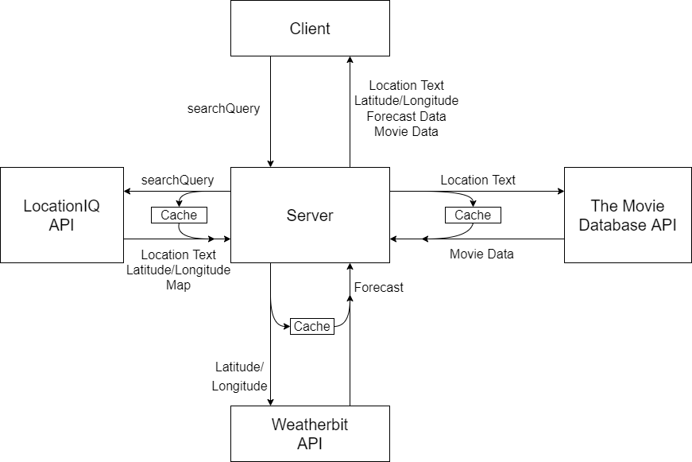

# city-explorer-api

**Author**: Daniel Frey
**Version**: 1.0.0

## Overview

Provides the backend for the city explorer project

## Getting Started
<!-- What are the steps that a user must take in order to build this app on their own machine and get it running? -->

## Architecture
<!-- Provide a detailed description of the application design. What technologies (languages, libraries, etc) you're using, and any other relevant design information. -->

## Change Log
<!-- Use this area to document the iterative changes made to your application as each feature is successfully implemented. Use time stamps. Here's an example:

01-01-2001 4:59pm - Application now has a fully-functional express server, with a GET route for the location resource. -->

|Set up Server Repository||
|---|---|
|Estimate of time needed to complete|30 minutes|
|Start time|4:20 PM|
|Finish time|4:40 PM|
|Actual time needed to complete|20 minutes|

|Weather info placeholder||
|---|---|
|Estimate of time needed to complete|1 hour 30 minutes|
|Start time|4:50 PM|
|Finish time|late|
|Actual time needed to complete|3.5 hours|

|Weather info live||
|---|---|
|Estimate of time needed to complete|1 hour 30 minutes|
|Start time|5:00 PM|
|Finish time|6:00 PM|
|Actual time needed to complete|1 hour|

## Credit and Collaborations
<!-- Give credit (and a link) to other people or resources that helped you build this application. -->